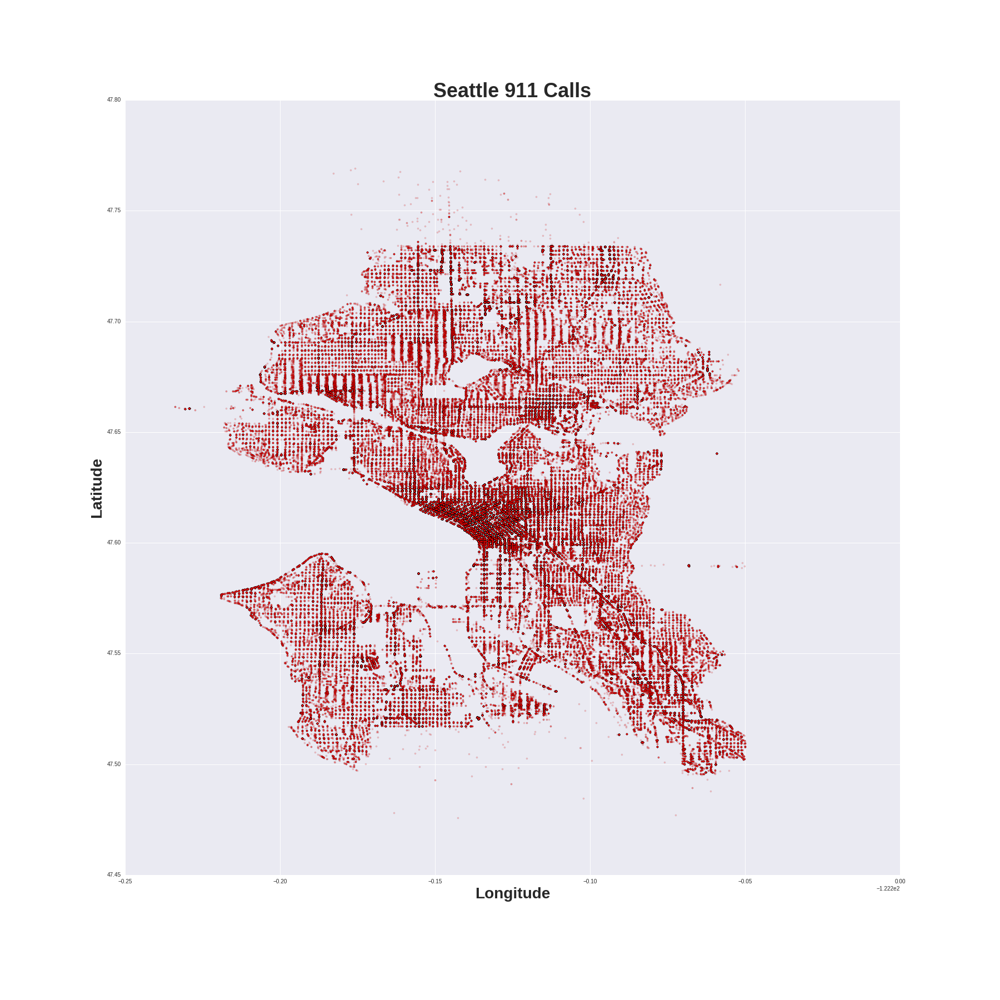

# Seattle 911 Plots

#### Logarithmic heat map of Seattle 911 calls.
 

#### Plot of 550,000 Seattle 911 calls by location.
 
Plots of public [Seattle 911](https://data.seattle.gov/Public-Safety/Seattle-Police-Department-911-Incident-Response/3k2p-39jp/data) data in the images folder.  Python code can be found in the Jupyter Notebook in the src folder.
 
 

